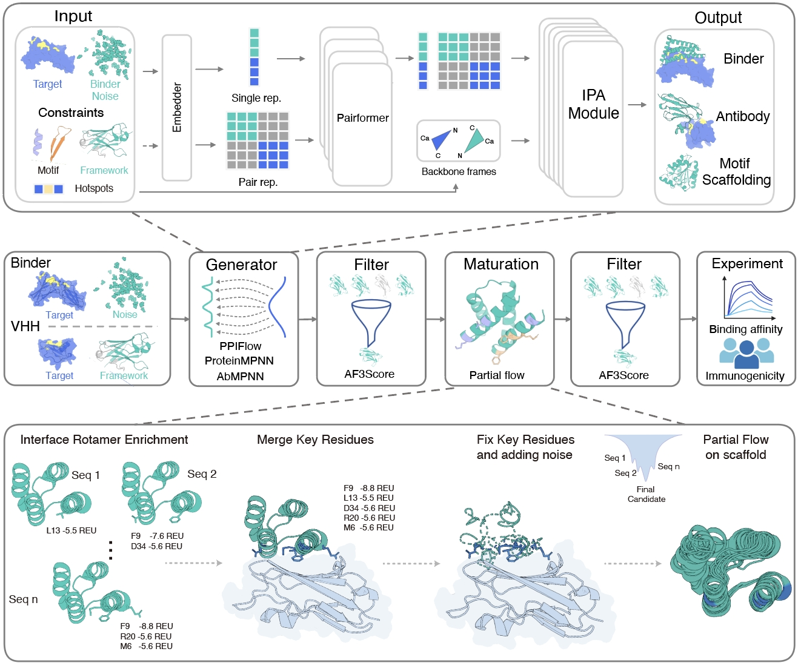

# PPIFlow Pipeline

PPIFlow is a two-stage protein design pipeline for generating and in silico maturing protein-protein interaction designs. The pipeline is orchestrated by `pipeline.py` and supports three design modes:

- `binder`
- `antibody`
- `nanobody`

The workflow integrates structure generation, sequence design, side-chain packing, AlphaFold 3-based scoring/refolding, filtering, partial redesign, DockQ evaluation, Rosetta relaxation, ranking, and report generation.

For each design task, the pipeline writes results under the configured `output_base_dir` and produces a final `design_output` directory containing designed PDB structures, sequences, evaluation metrics, and a design report.



> For documentation specific to the PPIFlow model, see [`tools/PPIFlow/README.md`](./tools/PPIFlow/README.md).

---

## Recent Updates

- Fixed the `RankStep` `rank_socore` bug ([issue #35](https://github.com/Mingchenchen/PPIFlow/issues/35)).
- Fixed the `MPNNStep_stage2` key-residue merge bug ([issue #31](https://github.com/Mingchenchen/PPIFlow/issues/31)).
- Added binder design with motif scaffolding ([issue #26](https://github.com/Mingchenchen/PPIFlow/issues/26)).

---

## Pipeline Overview

`pipeline.py` reads two YAML configuration files:

- `task.yaml`: defines task metadata, biological inputs, generation mode, output location, sampling parameters, and per-step enable/disable switches.
- `steps.yaml`: defines executable paths, model paths, and runtime parameters for each pipeline step.

The scheduler creates the following stage directories under `output_base_dir`:

```text
output_base_dir/
├── stage1/
├── stage2/
└── design_output/    # generated when the reporting workflow completes
```

Stage 1 and Stage 2 can be run independently or sequentially.

### Stage 1: Generation and Initial Filtering

Typical Stage 1 flow:

1. `PPIFlowStep`
2. `MPNNStep_stage1` or `AbMPNNStep_stage1`
3. `FlowpackerStep_stage1`
4. `AF3scoreStep_stage1`
5. `FilterStep_stage1`

Stage 1 generates candidate structures and sequences, packs side chains, scores designs with AlphaFold 3-based metrics, and filters candidates before maturation.

### Stage 2: Maturation, Refolding, and Ranking

Typical Stage 2 flow:

1. `RosettaFixStep`
2. `PartialStep`
3. `MPNNStep_stage2` or `AbMPNNStep_stage2`
4. `FlowpackerStep_stage2`
5. `AF3scoreStep_stage2`
6. `FilterStep_stage2`
7. `ReFoldStep`
8. `DockQStep`
9. `RosettaRelaxStep`
10. `RankStep`
11. `ReportStep`

The exact execution order and output-directory mapping are implemented in `pipeline.py`.

---

## Environment and Installation

### Tested Environment

The pipeline has been tested with:

- Ubuntu 22.04.5 LTS
- NVIDIA RTX 4090 GPU
- CUDA 12.6

### Prerequisites

Install the following system dependencies before setting up PPIFlow:

1. **Conda** - used to create and manage the runtime environment.
2. **CUDA 12.6** - required by the tested GPU environment.
3. **Git** - required to clone and manage the repository.
4. **GCC/G++** - required to compile native extensions.
5. **CMake** - required to configure and build C/C++ components.

### Install PPIFlow

```bash
git clone https://github.com/Mingchenchen/PPIFlow.git
cd PPIFlow

bash Install.sh
```

### Install Rosetta

Rosetta is distributed under a separate license. Make sure your intended use is permitted by the applicable Rosetta license before downloading or running it. Academic/non-profit and commercial use are governed by different terms; see [Third-Party Software and Licensing](#third-party-software-and-licensing).

An example archive used by the original setup is:

```bash
wget https://downloads.rosettacommons.org/downloads/academic/2024/wk09/rosetta.binary.linux.release-371.tar.bz2
tar -xvf rosetta.binary.linux.release-371.tar.bz2
```

> The exact Rosetta release and download mechanism may change. Prefer the current Rosetta Commons download instructions when setting up a new environment.

### Known glibc Compatibility Issue

The packages `torch-scatter`, `torch-sparse`, `torch-cluster`, and `torch-spline-conv` require glibc 2.32 in the provided setup.

Systems such as Rocky Linux 8.10, RHEL 8, CentOS 8, and AlmaLinux 8 typically ship with an older glibc version. On these systems, the affected packages need to be built from source.

### Download PPIFlow Checkpoints

Download the PPIFlow checkpoints from the project [Google Drive folder](https://drive.google.com/drive/folders/1BcIBUL2yq1gOchHfN68-AcZK3hiMAMVN?usp=drive_link).

| Task type | Checkpoint |
| --- | --- |
| Binder | `binder.ckpt` |
| Antibody | `antibody.ckpt` |
| Nanobody | `nanobody.ckpt` |
| Monomer / motif scaffolding | `monomer.ckpt` |

### External Model Requirements

Before running the full pipeline, also prepare:

- FlowPacker model weights under `./tools/flowpacker/checkpoints`.
- AlphaFold 3 source code, databases, and model parameters according to the official AlphaFold 3 setup instructions and terms of use.
- Rosetta / PyRosetta where required by the configured steps.

Useful upstream projects:

- FlowPacker: https://gitlab.com/mjslee0921/flowpacker
- ProteinMPNN: https://github.com/dauparas/ProteinMPNN
- AlphaFold 3: https://github.com/google-deepmind/alphafold3
- Rosetta: https://rosettacommons.org/
- PyRosetta: https://www.pyrosetta.org/

---

## Running the Pipeline

Before running `pipeline.py`, configure both `task.yaml` and `steps.yaml`. In particular, replace example executable, model, database, and tool paths with paths valid on your system.

### Full Run

```bash
python pipeline.py \
  --task example/task_binder.yaml \
  --steps example/steps_config/steps_binder.yaml
```

If `--stage` is omitted, both stages run sequentially.

### Stage 1 Only

```bash
python pipeline.py \
  --task example/task_binder.yaml \
  --steps example/steps_config/steps_binder.yaml \
  --stage 1
```

### Stage 2 Only

```bash
python pipeline.py \
  --task example/task_binder.yaml \
  --steps example/steps_config/steps_binder.yaml \
  --stage 2
```

> Stage 2 normally expects outputs generated by Stage 1. If Stage 2 is run independently, the required intermediate files must be prepared manually.

### CLI Arguments

| Argument | Description |
| --- | --- |
| `--task` | Path to the task configuration YAML file. |
| `--steps` | Path to the per-step configuration YAML file. |
| `--stage` | Optional stage selector: `1` or `2`. If omitted, both stages run. |

---

## Performance and Scaling Notes

The pipeline runs on a single GPU per process.

For large-scale inference, batch jobs can be distributed across multiple GPUs. A practical workload is approximately **1,000-2,000 designs per GPU**, depending on sequence length, structure size, available memory, and enabled steps.

The following Stage 2 steps are especially CPU-intensive and may dominate wall-clock time:

- `ReFoldStep` (MSA-related processing)
- `DockQStep`
- `RosettaRelaxStep`

For large runs, consider executing these steps separately on high-performance CPU nodes.

> The example `task_binder.yaml` uses a small `samples_per_target` value. With only a few generated backbones, all candidates may fail `FilterStep_stage1`, causing the workflow to stop after Stage 1. This is expected behavior rather than a pipeline error. Increase `samples_per_target` or adjust the Stage 1 filtering criteria in `steps_binder.yaml` when necessary.

---

## `task.yaml` Configuration

`task.yaml` has two top-level sections:

```yaml
task:
  # task metadata and biological inputs

steps:
  # step enable/disable switches
```

- `task` stores run metadata, biological inputs, sampling parameters, and the output directory.
- `steps` maps pipeline step names to booleans controlling whether each step is executed.

### Minimal Example

```yaml
task:
  name: "example"
  gentype: "binder"
  output_base_dir: "./outputs/example"

steps:
  PPIFlowStep: true
  MPNNStep_stage1: true
  FlowpackerStep_stage1: true
  AF3scoreStep_stage1: true
  FilterStep_stage1: true
  RosettaFixStep: false
  PartialStep: false
  MPNNStep_stage2: false
  FlowpackerStep_stage2: false
  AF3scoreStep_stage2: false
  FilterStep_stage2: false
  ReFoldStep: false
  DockQStep: false
  RosettaRelaxStep: false
  RankStep: false
  ReportStep: false
```

### Common `task` Fields

| Field | Description |
| --- | --- |
| `name` | Run name used as the design prefix. |
| `gentype` | Design mode: `binder`, `antibody`, or `nanobody`. |
| `output_base_dir` | Root output directory for the run. |
| `samples_per_target` | Number of structures sampled by PPIFlow. |
| `specified_hotspots` | Optional comma-separated hotspot residues, for example `B67,B78,B99`. |

### Binder Configuration

The following fields are consumed by `PPIFlowStep` when `gentype: binder`:

| Field | Description |
| --- | --- |
| `input_pdb` | Input target or target-binder complex PDB. |
| `target_chain` | Target protein chain ID in `input_pdb`. |
| `binder_chain` | Binder chain ID in `input_pdb`. Omit this field when only the target chain is provided. |
| `samples_min_length` | Minimum sampled binder length. |
| `samples_max_length` | Maximum sampled binder length. |

Example:

```yaml
task:
  name: "CD3d"
  gentype: "binder"
  input_pdb: "example/target_and_framework_pdb/CD3d.pdb"
  target_chain: "B"
  binder_chain: "A"
  specified_hotspots: "B67,B78,B99"
  samples_min_length: 50
  samples_max_length: 60
  samples_per_target: 10000
  output_base_dir: "../test_pipeline_binder"
```

### Antibody Configuration

The following fields are used when `gentype: antibody`:

- `antigen_pdb`
- `antigen_chain`
- `framework_pdb`
- `heavy_chain`
- `light_chain`
- `cdr_length`

Example:

```yaml
task:
  name: "IL13"
  gentype: "antibody"
  antigen_pdb: "example/target_and_framework_pdb/1IJZ_IL13.pdb"
  antigen_chain: "C"
  specified_hotspots: "C10,C13,C14,C100,C106,C107"
  framework_pdb: "example/target_and_framework_pdb/6nou_scfv_framework.pdb"
  heavy_chain: "A"
  light_chain: "B"
  cdr_length: "CDRH1,8-8,CDRH2,8-8,CDRH3,10-20,CDRL1,6-9,CDRL2,3-3,CDRL3,9-11"
  samples_per_target: 10
  output_base_dir: "../test_pipeline_antibody"
```

### Nanobody Configuration

The following fields are used when `gentype: nanobody`:

- `antigen_pdb`
- `antigen_chain`
- `framework_pdb`
- `heavy_chain`
- `cdr_length`

Example:

```yaml
task:
  name: "IL13"
  gentype: "nanobody"
  antigen_pdb: "example/target_and_framework_pdb/1IJZ_IL13.pdb"
  antigen_chain: "C"
  specified_hotspots: "C10,C13,C14,C100,C106,C107"
  framework_pdb: "example/target_and_framework_pdb/7eow_nanobody_framework.pdb"
  heavy_chain: "A"
  cdr_length: "CDRH1,8-8,CDRH2,8-8,CDRH3,9-21"
  samples_per_target: 10
  output_base_dir: "../test_pipeline_nanobody"
```

---

## `steps.yaml` Configuration

`steps.yaml` stores runtime parameters and external-tool paths for each pipeline component. The scheduler loads the configuration block corresponding to each enabled step and passes it to the relevant step class.

Start from the example matching your design mode:

- `example/steps_config/steps_binder.yaml`
- `example/steps_config/steps_antibody.yaml`
- `example/steps_config/steps_nanobody.yaml`

Update all environment-specific paths before running. Absolute paths are recommended for values such as:

- `python`
- model weights
- configuration files
- databases
- `rosetta_bin`
- other external executables

For step-specific parameters and expected inputs/outputs, see [`steps/README.md`](./steps/README.md).

---

## Output Directory Layout

The scheduler uses fixed subdirectory names under `output_base_dir`.

```text
output_base_dir/
├── stage1/
│   ├── ppiflow_output/
│   ├── mpnn_pdbs/
│   ├── mpnn_output/ or abmpnn_output/
│   ├── flowpacker_output/
│   ├── af3score_output/
│   └── filtered_iptm07/
├── stage2/
│   ├── rosetta_fix_output/
│   ├── fixed_positions.csv
│   ├── before_partial_pdbs/
│   ├── partial_output/
│   ├── mpnn_pdbs/
│   ├── mpnn_output/ or abmpnn_output/
│   ├── flowpacker_output/
│   ├── af3score_output/
│   ├── filtered_iptm08/
│   ├── refold_output/
│   ├── dockq_output/
│   └── rosetta_relax_output/
└── design_output/
```

`design_output` contains the final structures, sequences, computed evaluation metrics, and design report produced by the completed pipeline.

---

## Third-Party Software and Licensing

PPIFlow integrates or depends on several independently licensed software packages, model implementations, model parameters, and databases. **The license of this repository does not replace, override, or relicense any third-party component.** You are responsible for reviewing and complying with all applicable upstream terms before using the corresponding pipeline steps.

### PPIFlow Repository License

Unless otherwise stated for a specific file or component, this repository is distributed under the **Creative Commons Attribution-NonCommercial-ShareAlike 4.0 International (CC BY-NC-SA 4.0)** license as provided in [`LICENSE.txt`](./LICENSE.txt).

In particular, the `NonCommercial` condition restricts use that is primarily intended for or directed toward commercial advantage or monetary compensation. Consult the full license text for the legally controlling terms.

### AlphaFold 3

PPIFlow uses AlphaFold 3-related functionality for scoring and/or refolding steps.

- The **AlphaFold 3 source code** is licensed under the **Apache License 2.0**.
- The **official AlphaFold 3 model parameters** are distributed under separate **AlphaFold 3 Model Parameters Terms of Use**, not under Apache-2.0.
- Under the currently published model-parameter terms, the official parameters and associated output are available for specified **non-commercial use by or on behalf of non-commercial organizations**, subject to additional prohibited-use, sharing, attribution, and output conditions.
- Do not redistribute AlphaFold 3 model parameters unless the applicable terms explicitly permit it.

Before using AlphaFold 3 in this pipeline, review the current upstream terms:

- Repository: https://github.com/google-deepmind/alphafold3
- Model parameter terms: https://github.com/google-deepmind/alphafold3/blob/main/WEIGHTS_TERMS_OF_USE.md
- Output terms: https://github.com/google-deepmind/alphafold3/blob/main/OUTPUT_TERMS_OF_USE.md
- Prohibited-use policy: https://github.com/google-deepmind/alphafold3/blob/main/WEIGHTS_PROHIBITED_USE_POLICY.md

### Rosetta

Rosetta is **not OSI open-source software**. Rosetta Commons makes Rosetta available under its own licensing model:

- Academic, government, and other qualifying non-commercial users can obtain Rosetta under the Rosetta non-commercial license.
- Commercial or for-profit use requires a separate commercial license from the University of Washington / UW CoMotion.
- Redistribution is restricted by the Rosetta license.

See:

- Rosetta licensing FAQ: https://rosettacommons.org/software/licensing-faq/
- Rosetta license: https://docs.rosettacommons.org/demos/latest/LICENSE

### PyRosetta

PyRosetta is distributed separately from Rosetta and is subject to its own license terms.

- Downloads from the PyRosetta site are provided to academic and non-commercial users under the **PyRosetta Software Non-Commercial License Agreement**.
- Commercial use requires a separate license.
- The upstream documentation explicitly notes that fee-for-service work is considered commercial use for licensing purposes.

See:

- https://www.pyrosetta.org/downloads

### FlowPacker

FlowPacker is used for protein side-chain packing. The upstream FlowPacker repository is licensed under the **MIT License**.

See:

- Repository: https://gitlab.com/mjslee0921/flowpacker
- License: https://gitlab.com/mjslee0921/flowpacker/-/blob/main/LICENSE

### ProteinMPNN

ProteinMPNN is used for protein sequence design in relevant pipeline steps. The upstream ProteinMPNN repository is licensed under the **MIT License**.

See:

- Repository: https://github.com/dauparas/ProteinMPNN
- License: https://github.com/dauparas/ProteinMPNN/blob/main/LICENSE

### License Compatibility and User Responsibility

Because this pipeline combines components with different licenses and use restrictions, permission to use one component does **not** imply permission to use the complete pipeline for the same purpose. This is especially important for commercial use, redistribution, hosted services, and sharing of model parameters.

Before distributing, deploying, or using PPIFlow in a commercial setting, review at least:

1. `LICENSE.txt` in this repository.
2. AlphaFold 3 model-parameter and output terms.
3. Rosetta and PyRosetta licensing requirements.
4. The licenses of FlowPacker, ProteinMPNN, and any other bundled or externally installed dependencies.

This section is provided for documentation purposes only and is not legal advice. The upstream license and terms-of-use documents are authoritative and may change over time.

---

## Notes

- Stage 2 normally depends on Stage 1 outputs unless the required intermediate files are prepared manually.
- Replace all example paths in `steps.yaml` with paths valid for your environment.
- The files under `example/` are the recommended starting point for new design tasks.
- Third-party tools, model weights, and databases may have installation, access, redistribution, citation, and use restrictions independent of PPIFlow.

---

## Citation

If you use PPIFlow in academic work, please cite:

```bibtex
@article{yu2026ppiflow,
  author = {Yu, Qilin and Guo, Liangyue and Qin, Xiayan and Huang, Xikun and Tian, Baihui and Wang, Hongzhun and Liu, Yu and Lang, Yunzhi and Wang, Di and Shen, Zhouhanyu and Lin, Jie and Chen, Mingchen},
  title = {High-Affinity Protein Binder Design via Flow Matching and In Silico Maturation},
  year = {2026},
  doi = {10.64898/2026.01.19.700484},
  journal = {bioRxiv}
}
```
